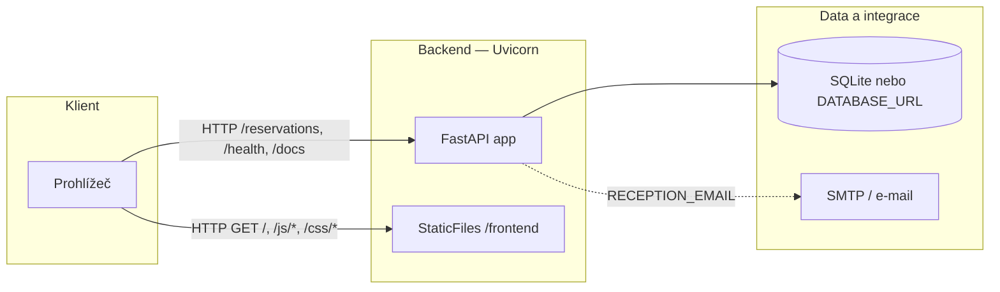
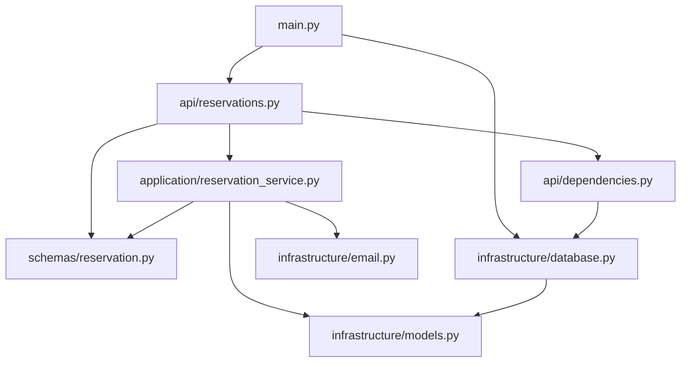
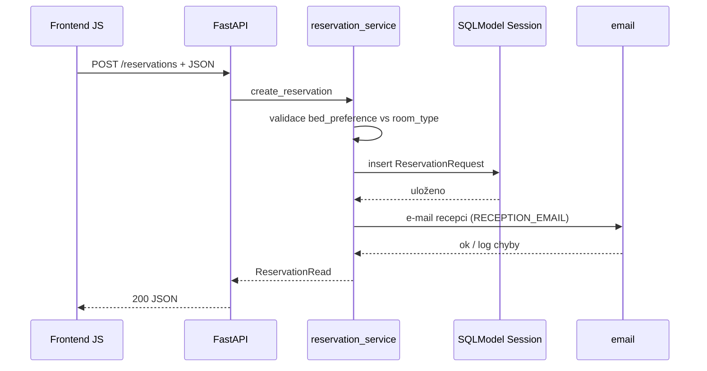
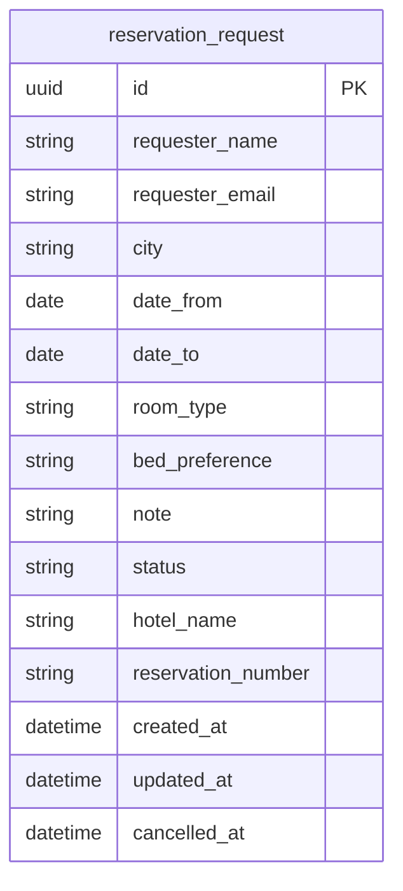
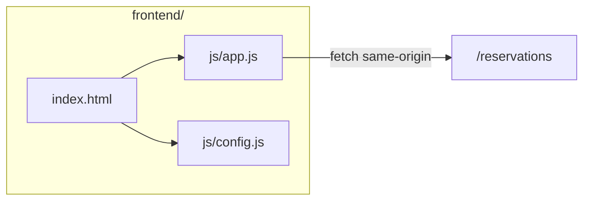
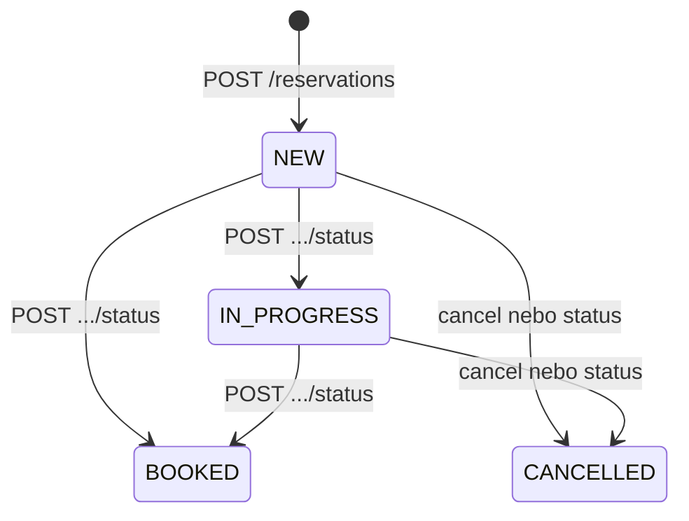
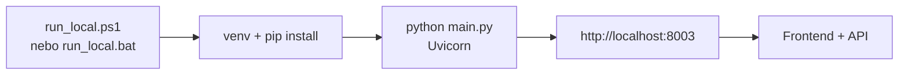

# Grafy architektury — Rezervace hotelu

Přehled komponent, závislostí, **workflow** procesů a toků dat. Diagramy jsou v [Mermaid](https://mermaid.js.org/) — zobrazí je GitHub, GitLab i mnoho editorů (včetně náhledu Markdownu v Cursoru).

---

## 1. Běhové prostředí (localhost)

Jeden proces **Uvicorn** obsluhuje API i statický frontend ze stejného originu.



- **Výchozí URL:** `http://localhost:8003` (nebo `127.0.0.1:8003`). Port a host: `PORT`, `HOST` v `.env`.
- **Databáze:** bez `DATABASE_URL` se použije `backend/hotel_local.db`.

---

## 2. Vrstvy backendu (závislosti modulů)



**Směr závislostí:** HTTP vrstva (`api`) volá aplikační logiku (`application`), ta používá modely a infrastrukturu (`infrastructure`). Schémata Pydantic (`schemas`) oddělují API kontrakty od DB entit.

---

## 3. REST API — prefix `/reservations`

```mermaid
flowchart LR
    R[Router reservations]
    R --> C[POST "" — vytvoření]
    R --> L[GET "" — seznam]
    R --> G[GET /{id}]
    R --> P[PUT /{id}]
    R --> X[POST /{id}/cancel]
    R --> ST[POST /{id}/status]
```

Další endpointy v `main.py`: `GET /health`, OpenAPI na `/docs`, frontend pod `/` (kromě cest vyhrazených pro API).

---

## 4. Tok: vytvoření rezervace



---

## 5. Entita v databázi



Enumy v kódu: `RequestStatus`, `City`, `RoomType`, `BedPreference` — mapované na řetězce v DB.

---

## 6. Frontend → API



`config.js` nastaví `window.__API_BASE__` (prázdný řetězec = stejný origin jako stránka). Query `?api=` umožní přepsat základ URL pro vývoj.

---

## 7. Workflow — životní cyklus stavu žádosti

Stavy odpovídají `RequestStatus` v `infrastructure/models.py`. Přechody provádí backend podle volaného endpointu a validací v `reservation_service`.



- Přechod do **BOOKED** přes `POST .../status` vyžaduje v těle `hotel_name` a `reservation_number`.
- Ze stavu **BOOKED** žadatel **nesmí** `PUT` ani `POST .../cancel` (HTTP 400).
- Ve stavu **CANCELLED** žadatel **nesmí** `PUT` (400); opakované `cancel` vrátí již zrušený záznam.
- Další změny stavu z backoffice řeší stejný endpoint `POST .../status` (bez omezení „žadatele“ jako u `PUT`/`cancel`).

**Pravidla v kódu (zjednodušeně):**

| Stav        | Žadatel: `PUT` údajů | Žadatel: `POST .../cancel` | Interní: `POST .../status` |
|------------|----------------------|----------------------------|----------------------------|
| NEW        | ano (stejný e-mail)  | ano                        | ano                        |
| IN_PROGRESS| ano                  | ano                        | ano                        |
| BOOKED     | ne (400)             | ne (400)                   | ano (např. doplnění polí)  |
| CANCELLED  | ne (400)             | vrátí stav zrušené        | záleží na volbě statusu    |

Při přechodu na **BOOKED** musí tělo požadavku obsahovat `hotel_name` a `reservation_number`; žadateli se odešle potvrzovací e-mail (`infrastructure/email.py`).

---

## 8. Workflow — role a kanály (žadatel vs recepce / backoffice)

```mermaid
flowchart TB
    subgraph public [Veřejný web — frontend]
        F1[Vyplnění formuláře]
        F2[Odeslání POST /reservations]
        F3[Vyhledání podle UUID\nGET /reservations/{id}]
        F1 --> F2 --> OK[Zobrazení UUID a stavu NEW]
        F3 --> STAV[Zobrazení stavu a detailů]
    end
    subgraph api [API — také /docs, curl, integrace]
        E1[PUT /reservations/{id}\n+ e-mail žadatele]
        E2[POST .../cancel\n+ e-mail žadatele]
        E3[POST .../status\nstav, hotel, číslo]
    end
    subgraph notify [Notifikace]
        M1[E-mail recepci\nRECEPTION_EMAIL]
        M2[E-mail žadateli\npři BOOKED]
    end
    F2 --> M1
    E1 --> M1
    E2 --> M1
    E3 --> M2
    R[Recepce / admin] --> E3
    Z[Žadatel] --> E1
    Z --> E2
```

- **Frontend** dnes implementuje hlavně **novou žádost** a **dotaz podle UUID**; úpravy, zrušení a změna stavu jsou určené pro volání z API (Swagger, skript, interní nástroj).
- Ověření identity žadatele u `PUT` a `cancel` je **e-mailem** shodným s uloženým záznamem (403 při nesouladu).

---

## 9. Workflow — uživatelská cesta na stránce (UI)

```mermaid
flowchart TD
    A[Načtení /] --> B{Formulář nové žádosti}
    B --> C{Validace dat v prohlížeči\nnapř. datum od/do}
    C -->|chyba| B
    C -->|OK| D[fetch POST /reservations]
    D -->|chyba sítě / API| E[Chybová hláška]
    D -->|422/400| E
    D -->|200| F[Úspěch + UUID + stav]
    A --> G[Formulář dotazu UUID]
    G --> H[GET /reservations/{id}]
    H -->|404 / chyba| I[Chybová hláška]
    H -->|200| J[Detail stavu, město, termín, hotel/číslo]
```

---

## 10. Workflow — lokální vývoj (spuštění)



Volitelně v `backend/.env`: `DATABASE_URL`, `HOST`, `PORT`, `UVICORN_RELOAD`, `RECEPTION_EMAIL`, SMTP proměnné pro reálné e-maily.

---

*Soubor slouží jako rychlá mapa projektu; při větších změnách architektury a procesů ho aktualizujte.*
